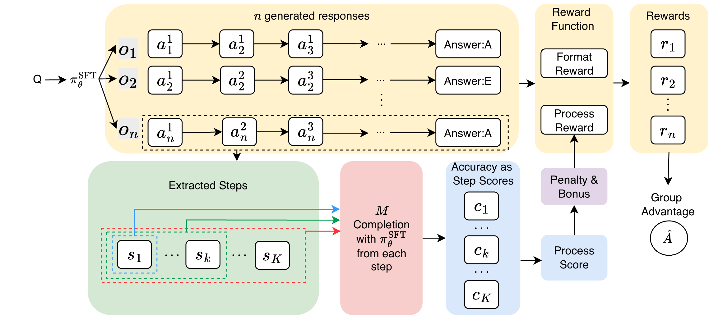

# ProcessThinker: Enhancing Multimodal LLM Reasoning via Rollout-based Process Reward

> Under review at ICLR 2026. Repository accompanies the submission  
> *ProcessThinker: Enhancing Multi-modal Large Language Models Reasoning via Rollout-based Process Reward*.

ProcessThinker is a practical post-training pipeline that provides **step-level process rewards without training a separate PRM**. For each intermediate step in a chain-of-thought trace, we sample several continuations from the current policy and use the **empirical success rate** (final-answer verification) as the step reward. Combined with lightweight formatting constraints, this dense signal is plugged directly into GRPO and consistently improves Qwen3-VL-8B-Instruct on video reasoning benchmarks.

<p align="center">
  
</p>

**Pipeline.** Rollout-based process reward inside one GRPO update. For a question Q, π<sup>SFT</sup><sub>θ</sub> samples n responses o<sub>1</sub>…o<sub>n</sub>. For each response we extract step segments {s<sub>1</sub>, …, s<sub>m</sub>} and score each step k by the success rate of M continuation rollouts from prefix (s<sub>1</sub>, …, s<sub>k</sub>), producing step scores c<sub>k</sub> and the averaged CoT score. The final reward combines the format reward, CoT reward, and a bounded step-count bonus/penalty, then feeds into GRPO's group-relative advantage Â.

---

## 🧠 Method at a glance

**Step-tagged output format.** Every generation is constrained to

```
<think>
  <step>s_1</step>
  <step>s_2</step>
  ...
  <step>s_K</step>
</think>
<answer>ans</answer>
```

so intermediate steps are explicit and individually scorable.

**Rollout-based process reward (continuation solvability).** For a sampled response with steps `s_{1:K}`, each prefix `p_i = (s_1, ..., s_i)` is scored by how often the model can reach the correct answer when conditioned on that prefix:

```
c_i = (1/M) * Σ_{m=1..M}  1[ Ans(ŷ_i^(m)) == ans* ]        # M = 4 continuations per step
R_proc(y) = mean( c_1, ..., c_{min(K, K_max)} )             # K_max = 6
```

**Format reward, bounded step bonus, penalty gate.** The final reward for a format-valid response is

```
r = (r_fmt + β)                              # strict tag + length reward
  + λ_acc · R̄_acc                            # outcome reward, gated
  + λ_proc · R̄_proc                           # process reward, gated
  + B(K),       B(K) = α · sqrt( clip((K - K_min)/(K_max - K_min), 0, 1) )
```

with `λ_acc + λ_proc = 1`, and penalty gating

```
R̄_acc  = 1           if R_acc == 1 else -B(K)
R̄_proc = R_proc     if R_proc >= τ else -B(K),    τ = 0.5
```

If formatting is invalid we set `r = 0` and skip the (expensive) continuation rollouts.

The full implementation lives in [`EasyR1/verl/reward_function/processthinker_reward.py`](EasyR1/verl/reward_function/processthinker_reward.py) (see `compute_score`, `_process_reward_for_sample`, `compute_format_reward`).

---

## 📊 Results

Accuracy (%) on four video reasoning benchmarks, starting from **Qwen3-VL-8B-Instruct**:

| Model | Video-MMMU | MMVU (mc) | VideoMathQA | LongVideoBench | Avg. |
|---|---:|---:|---:|---:|---:|
| Video-R1-7B                 | 53.89 | 65.92 | 26.67 | 58.30 | 51.20 |
| Qwen3-VL-8B-Instruct (base) | 62.89 | 65.60 | 25.20 | 71.50 | 56.30 |
| ProcessThinker-SFT          | 58.78 | 64.48 | 23.57 | 68.50 | 53.83 |
| ProcessThinker (outcome-only)       | 60.78 | 67.36 | 27.86 | 74.20 | 57.55 |
| ProcessThinker (outcome + process)  | 61.67 | 67.52 | 27.86 | 74.60 | 57.91 |
| **ProcessThinker (process-only)**   | **63.33** | **68.48** | **31.67** | **75.40** | **59.72** |

All variants share the same SFT warm-up and differ only in the GRPO reward mixture `(λ_acc, λ_proc)`. **process-only** (`λ_acc=0, λ_proc=1`) is the recommended default and is what `EasyR1/examples/config_processthinker_grpo.yaml` now ships with.

---

## 📁 Repo layout

```
.
├── LLaMA-Factory/                    # Stage 1 – SFT cold start
│   ├── local_scripts/
│   │   └── run_processthinker_sft.sh
│   └── examples/train_full/
│       └── processthinker_sft.yaml
├── EasyR1/                           # Stage 2 – GRPO with process reward
│   ├── local_scripts/
│   │   └── run_processthinker_rl.sh   # main RL entry (assumes vLLM is already up)
│   ├── examples/
│   │   └── config_processthinker_grpo.yaml
│   └── verl/reward_function/
│       └── processthinker_reward.py   # ← rollout-based process reward
├── Evaluation/                       # VLMEvalKit + single-example inference
│   ├── Processthinker-eval/           # json files for custom eval
│   ├── VLMEvalKit/local_scripts/
│   │   └── eval_vlmevalkit.sh
│   └── inference_single/
│       └── inference.py
└── assets/
```

---

## 📐 Setup

```bash
git clone <this-repo>
cd Processthinker

# SFT env
conda create -n llamafactory python=3.11 -y
conda activate llamafactory
cd LLaMA-Factory && pip install -e ".[torch,metrics]" --no-build-isolation && cd ..

# RL env
conda create -n easyr1 python=3.11 -y
conda activate easyr1
cd EasyR1 && pip install -e . && cd ..
```

Details for each sub-environment mirror upstream [LLaMA-Factory](https://github.com/hiyouga/LLaMA-Factory) and [EasyR1](https://github.com/hiyouga/EasyR1).

---

## 🔍 Data

We release the step-tagged training splits used in the paper:

| Split | Size | Purpose |
|---|---:|---|
| `processthinker_sft_19k.json` | **19k** | SFT cold start (step-tagged CoT) |
| `processthinker_rl_1250.json` | **1,250** | GRPO prompts |

Both splits are derived from [VIDEO-R1-COT-165K](https://github.com/tulerfeng/Video-R1), rewritten into the `<step>` format by Qwen3-VL-30B-A3B-Instruct and filtered for (i) answer fidelity vs. the original solution, (ii) step–answer consistency and (iii) step quality. **The rewriting/filtering scripts are not part of this release**; we provide the final processed json files directly.

Each SFT sample is `sharegpt`-formatted and registered in `LLaMA-Factory/data/dataset_info.json` under `process_thinker_step_cot_70k` (rename in the yaml if you want to use the 19k split).

Update the following paths in the yaml/shell files to point to your local copies:

- `LLaMA-Factory/examples/train_full/processthinker_sft.yaml` → `dataset`, `dataset_dir`, `media_dir`, `model_name_or_path`, `output_dir`
- `EasyR1/examples/config_processthinker_grpo.yaml` → `data.train_files`, `worker.actor.model.model_path`
- `EasyR1/local_scripts/run_processthinker_rl.sh` → `MODEL_PATH`, `TRAIN_FILE`

---

## 🚀 Training

Recommended hardware: **8 × 80 GB GPUs** (e.g. H100) for both SFT and RL. For smaller setups, reduce frame count, resolution, or batch size.

### Stage 1 – SFT cold start

```bash
conda activate llamafactory
bash LLaMA-Factory/local_scripts/run_processthinker_sft.sh
```

This trains **ProcessThinker-SFT**, a Qwen3-VL-8B checkpoint that reliably emits parsable `<think><step>…</step></think><answer>…</answer>` traces.

### Stage 2 – GRPO with rollout-based process reward

> ⚠️ **Important.** RL training requires a **separate vLLM server** serving the *current* policy model; the reward function hits this server to sample the `M=4` continuations per step (`_process_reward_for_sample` in `processthinker_reward.py`). You must launch this vLLM instance on its own GPU(s) **before** starting RL, make sure `--served-model-name qwen`, and point `process_model_endpoint` in the config at it (default: `http://127.0.0.1:8000/v1/chat/completions`).

Then, with the vLLM endpoint healthy, launch the trainer:

```bash
conda activate easyr1
bash EasyR1/local_scripts/run_processthinker_rl.sh
```

Key knobs in `EasyR1/examples/config_processthinker_grpo.yaml`:

| Config key | Paper symbol | Default | Notes |
|---|---|---:|---|
| `acc_weight` | λ_acc | 0.0 | Set to 1.0 for outcome-only baseline |
| `cot_weight` | λ_proc | 1.0 | Process-only is the best config in Table 1 |
| `process_n` | M | 4 | Continuations per step prefix |
| `process_max_steps` | K_max | 6 | Cap on scored steps |
| `step_min`, `step_max` | K_min, K_max | 2, 6 | Strict format range |
| `l_min`, `l_max` | L_min, L_max | 280, 450 | Length bonus window |
| `r1_value`, `beta_value` | r_fmt, β | 0.5, 0.5 | Format / length rewards |
| `alpha` | α | 0.5 | Step-bonus scale |
| `penalty` | — | true | Enables `−B(K)` penalty gate |
| `process_model_endpoint` | — | — | Comma-separated list supported for load balancing |

~200 GRPO steps already yield strong performance; multi-node Ray is supported (see upstream [EasyR1](https://github.com/hiyouga/EasyR1)).

---

## 🔮 Inference & Evaluation

ProcessThinker-8B shares the Qwen3-VL-8B architecture, so any Qwen3-VL-compatible stack works.

**Four paper benchmarks.** We report on Video-MMMU, MMVU, VideoMathQA, and LongVideoBench using [VLMEvalKit](https://github.com/open-compass/VLMEvalKit):

```bash
bash Evaluation/VLMEvalKit/local_scripts/eval_vlmevalkit.sh
```

Edit the `DATASETS=(...)` array in the script to keep only the four paper benchmarks (other tasks included in the shipped script were run for completeness but are **not** reported in the paper).

**Single-example inference.**

```bash
python Evaluation/inference_single/inference.py
```

Edit `CHECKPOINT_PATH`, `MEDIA_PATH`, `QUESTION_TEXT`, `PROBLEM_TYPE` at the top of the file.

---

## ⚙️ Reproducing the main result (process-only)

1. Train SFT (`run_processthinker_sft.sh`) → `Processthinker-SFT-8B`.
2. Launch a vLLM server serving that SFT checkpoint (`--served-model-name qwen`). This is the **referee** used for continuation rollouts.
3. Launch `run_processthinker_rl.sh` with `acc_weight=0.0, cot_weight=1.0` (already the default).
4. Evaluate the final checkpoint via VLMEvalKit on the four video benchmarks.

Expected: average accuracy ≈ **59.7**, vs. 56.3 for the base Qwen3-VL-8B-Instruct (see Table 1).

---

## 🙏 Acknowledgements

Built on top of [LLaMA-Factory](https://github.com/hiyouga/LLaMA-Factory), [EasyR1](https://github.com/hiyouga/EasyR1) / [verl](https://github.com/volcengine/verl), [Video-R1](https://github.com/tulerfeng/Video-R1) (source of SFT CoT traces), [Qwen3-VL](https://github.com/QwenLM/Qwen3-VL), and [VLMEvalKit](https://github.com/open-compass/VLMEvalKit).

## 📜 Citation

```bibtex
@inproceedings{processthinker2026,
  title     = {ProcessThinker: Enhancing Multi-modal Large Language Models Reasoning via Rollout-based Process Reward},
  author    = {Anonymous},
  booktitle = {Submitted to ICLR},
  year      = {2026},
  note      = {Under review}
}
```
